<div align="center">
  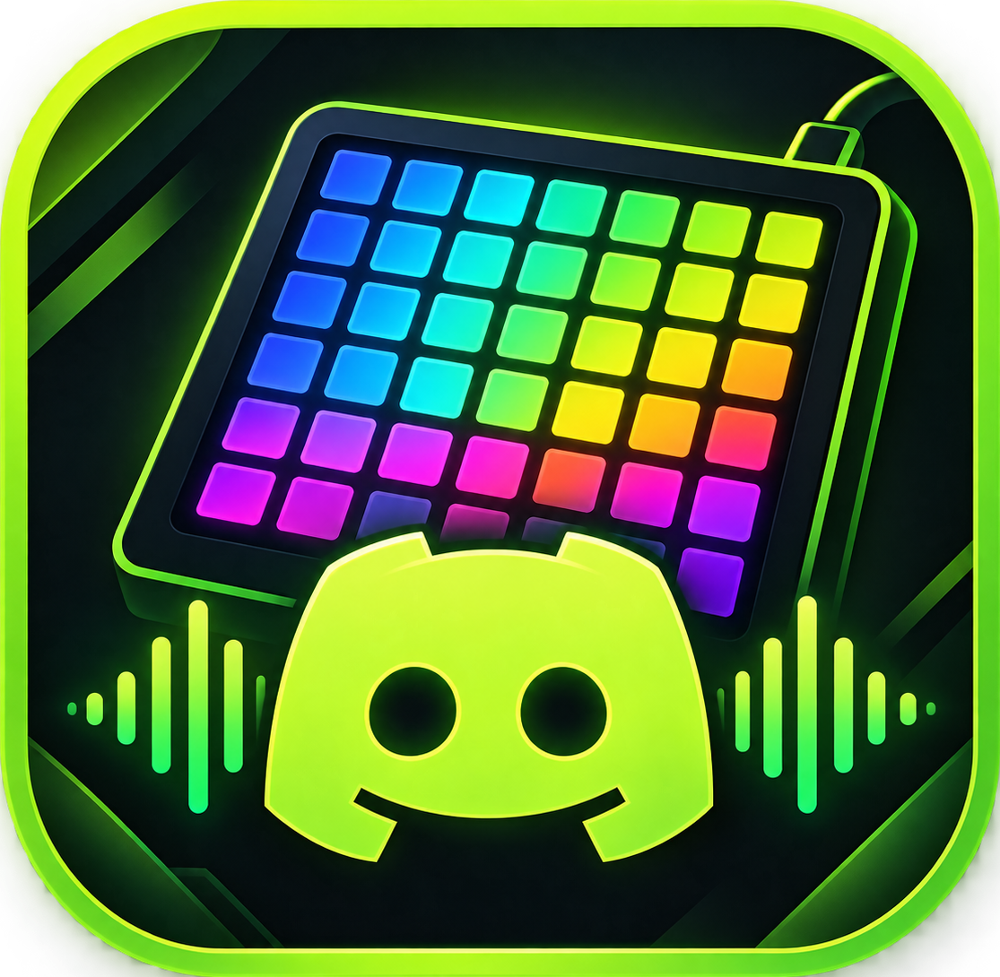
  <h1>Launchpad Studio Pro</h1>
  <p><strong>Sistema integral de Soundboard de baja latencia, iluminacion reactiva y control en vivo para Discord, OBS Studio y matrices de hardware STM32.</strong></p>
  <p>Plataforma disenada para streamers, creadores de contenido, gamers y musicos que requieren reproduccion instantanea de efectos de audio, control de escenas de transmision e iluminacion sincronizada sin configuraciones complejas.</p>
</div>

---

## Indice de Contenidos

1. [Arquitectura del Sistema](#arquitectura-del-sistema)
2. [Demostracion en Vivo (Efectos de Iluminacion)](#demostracion-en-vivo-efectos-de-iluminacion)
3. [Galeria de Animaciones de Fondo (Hardware 8x8)](#galeria-de-animaciones-de-fondo-hardware-8x8)
4. [Galeria de Efectos de Pulsacion (Hardware 8x8)](#galeria-de-efectos-de-pulsacion-hardware-8x8)
5. [Capturas de Pantalla de la Aplicacion](#capturas-de-pantalla-de-la-aplicacion)
6. [Modulos y Caracteristicas Principales](#modulos-y-caracteristicas-principales)
7. [Estructura del Proyecto](#estructura-del-proyecto)
8. [Requisitos del Entorno](#requisitos-del-entorno)
9. [Guia de Inicio Rapido](#guia-de-inicio-rapido)
10. [Despliegue del Bot y Configuracion (VPS vs. Modo Local)](#despliegue-del-bot-y-configuracion-vps-vs-modo-local)
11. [Compilacion de Paquetes Listos para Distribuir](#compilacion-de-paquetes-listos-para-distribuir)
12. [Integracion con OBS Studio (WebSocket v5)](#integracion-con-obs-studio-websocket-v5)
13. [Construccion de Hardware DIY (STM32F401)](#construccion-de-hardware-diy-stm32f401)
14. [Pila Tecnologica](#pila-tecnologica)

---

## Arquitectura del Sistema

El ecosistema opera mediante comunicacion bidireccional asincrona entre la aplicacion de escritorio, el bot de transmision de voz, las herramientas de streaming y el hardware opcional:

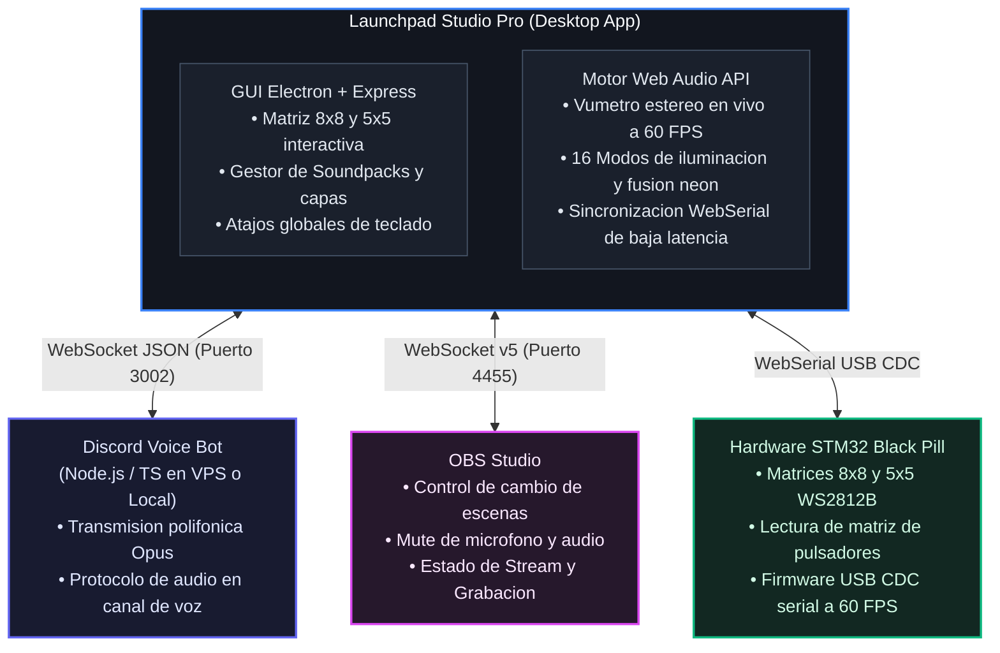

---

## Demostracion en Vivo (Efectos de Iluminacion)

Animacion fluida en tiempo real mostrando el efecto de fondo cromatico continuo (Rainbow Wave) combinado con la respuesta reactiva de iluminacion neon sobre la matriz de pads:

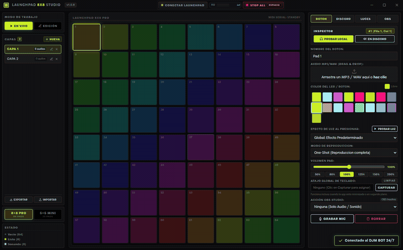

---

## Galeria de Animaciones de Fondo (Hardware 8x8)

El firmware y la aplicacion incluyen 16 animaciones psicodelicas generadas proceduralmente a 60 FPS con bucles continuos:

| # | Animacion | Previsualizacion 8x8 | # | Animacion | Previsualizacion 8x8 |
|:---:|---|:---:|:---:|---|:---:|
| **01** | **Rainbow Wave**<br>Onda cromatica fluyente 60FPS | 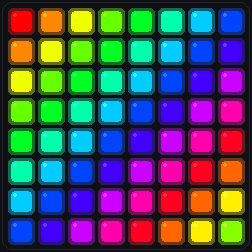 | **02** | **Matrix Rain**<br>Lluvia digital verde Matrix | 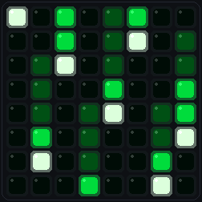 |
| **03** | **Nebula**<br>Aurora cosmica espacial | 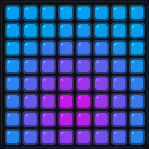 | **04** | **Breathing**<br>Respiracion glow pulsada | 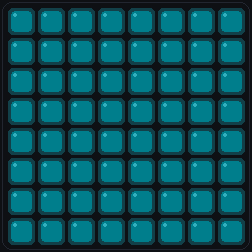 |
| **05** | **Fireworks**<br>Explosion de fuegos artificiales | 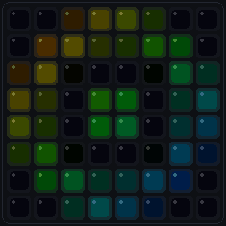 | **06** | **Ocean Waves**<br>Olas de oceano aqua y azul | 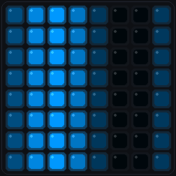 |
| **07** | **Inferno Flames**<br>Llamas de fuego ardiente | 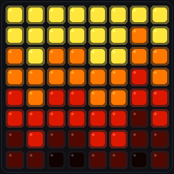 | **08** | **Cyber Spectrum**<br>Ecualizador neon reactivo | 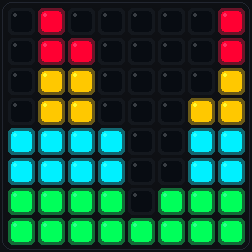 |
| **09** | **Plasma**<br>Esferas de energia plasmatica | 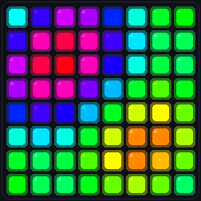 | **10** | **Hyperspace**<br>Viaje estelar y tunel warp | 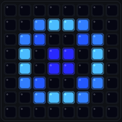 |
| **11** | **Acid Mandala**<br>Caleidoscopio psicodelico fractal | 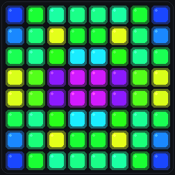 | **12** | **Cyber DMT**<br>Tunel hiperdimensional infinito | 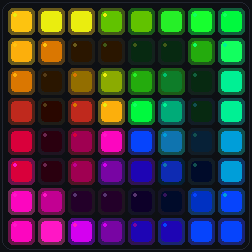 |
| **13** | **Neon Lava**<br>Fluido metaballs dinamico neon | 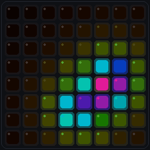 | **14** | **Quantum Vortex**<br>Vortice espiral acelerado | 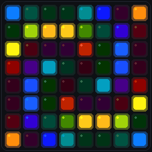 |
| **15** | **Psy Aurora**<br>Aurora boreal lisergica | 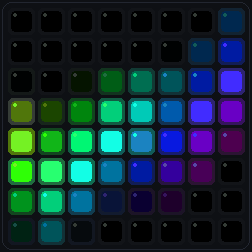 | **16** | **Audio Pulse**<br>Reactor de bajos y ritmo de audio | 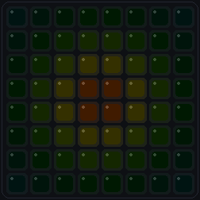 |

---

## Galeria de Efectos de Pulsacion (Hardware 8x8)

Animaciones reactivas de alta energia disparadas instantaneamente al pulsar cualquier boton fisico o virtual:

| # | Efecto | Previsualizacion 8x8 | # | Efecto | Previsualizacion 8x8 |
|:---:|---|:---:|:---:|---|:---:|
| **00** | **Direct Flash**<br>Destello blanco puro e instantaneo | 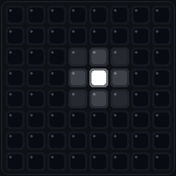 | **01** | **Ripple**<br>Onda expansiva circular 360 grados |  |
| **02** | **Crosshair**<br>Haz laser en cruz horizontal y vertical |  | **03** | **Starburst**<br>Explosion de particulas en 8 direcciones |  |
| **04** | **Lightning Storm**<br>Chispazo electrico de alta energia |  | **05** | **Crystal Diamond**<br>Onda geometrica en rombo | 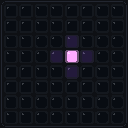 |
| **06** | **Volcanic Shockwave**<br>Onda de choque ardiente de fuego |  | **07** | **Vortex Spiral**<br>Giro cosmico centrifugo de plasma | 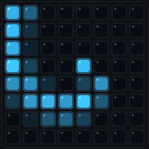 |
| **08** | **Hyper Neon Pulse**<br>Anillo concentrico de doble pulso | 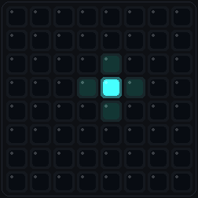 | **09** | **Quantum Prism**<br>Dispersion prismatica cromatica arcoiris | 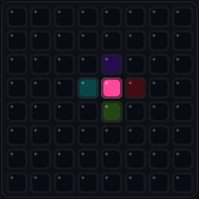 |
| **10** | **Supernova Shockwave**<br>Doble anillo cuantico super expansivo | 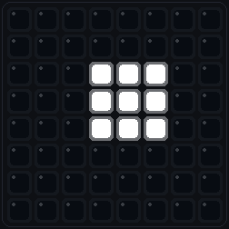 | **11** | **Spiral Dimension**<br>Rafaga de plasma en espiral rotatoria | 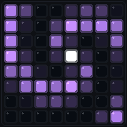 |
| **12** | **Tesla Arc**<br>Descargas y arcos voltaicos bifurcados | 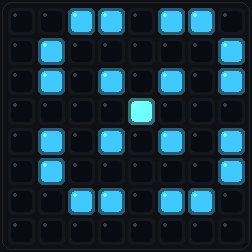 | | | |

---

## Capturas de Pantalla de la Aplicacion

### 1. Panel Principal e Inspector de Pads (Matriz Interactiva)
Matriz de 64 pads con selector de capas, vumetro estereo en tiempo real (Peak & RMS), controles de volumen, atajos globales y asignacion de color/audio por pad.

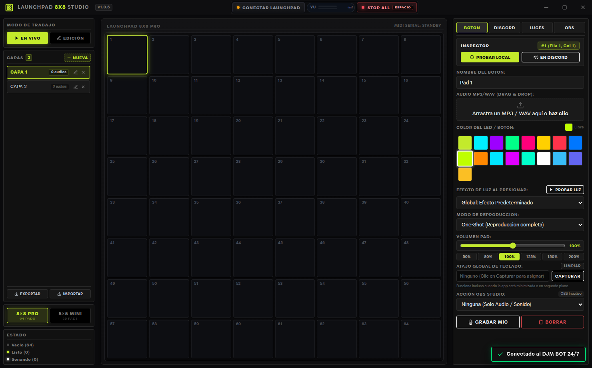

### 2. Motor de Iluminacion y Efectos LED
Configuracion de animaciones reactivas neon, selector de 13 algoritmos matematicos, iluminacion de fondo continua y previsualizacion interactiva del hardware en tiempo real.

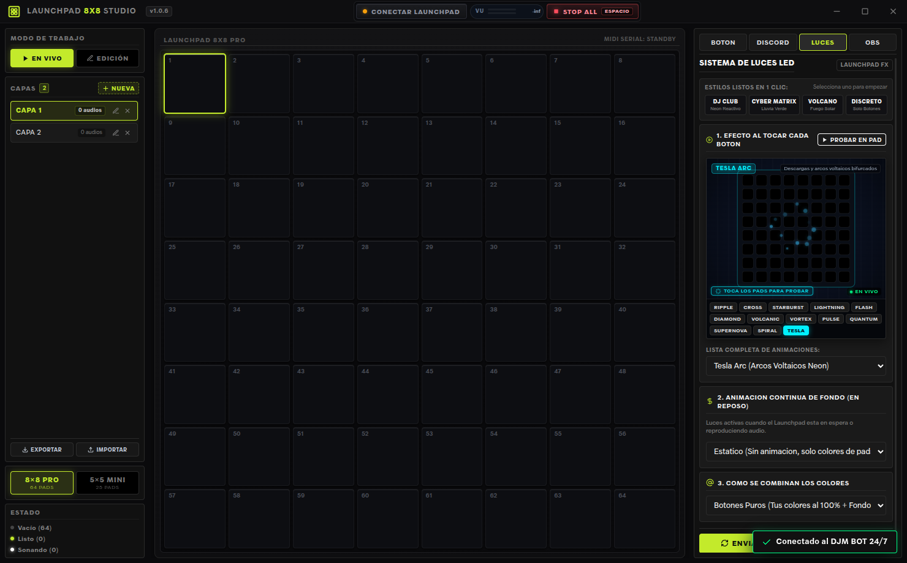

### 3. Transmision a Discord y Monitoreo de Audio
Control del bot de Discord (DJM BOT) con enlace a servidor en la nube (VPS 24/7), selector de canal de voz activo, volumen de emision y monitoreo local en auriculares.

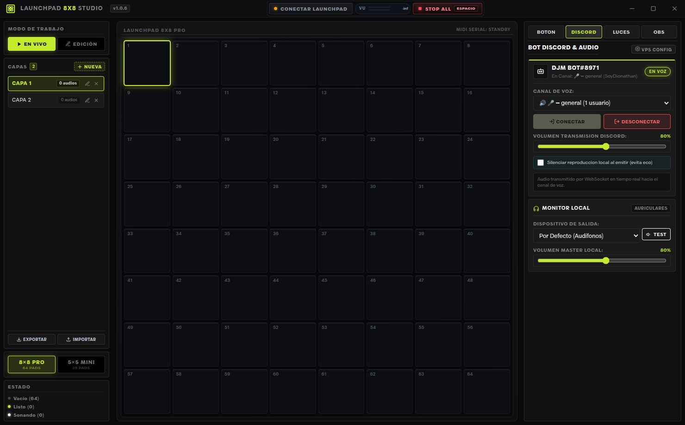

### 4. Integracion con OBS Studio
Conexion por OBS WebSocket v5 para alternar escenas de transmision, silenciar fuentes de captura y controlar grabaciones o directos desde la matriz.

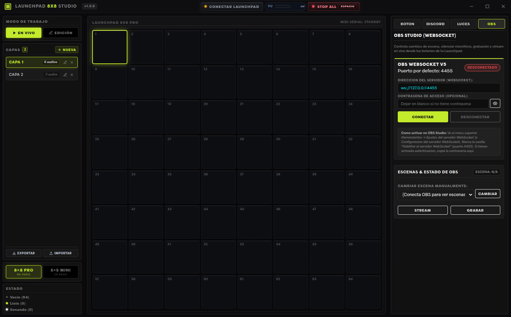

---

## Modulos y Caracteristicas Principales

### 1. Motor de Audio de Cero Latencia
* Reproduccion polifonica inmediata mediante Web Audio API.
* Carga por lotes (Batch Upload): arrastre simultaneo de multiples archivos de sonido distribuidos automaticamente en la cuadricula.
* Gestion de multiples capas (Bancos de sonido) para categorizar librerias completas sin limite de efectos.
* Sistema de paquetes portables `.soundpack` comprimidos en formato ZIP con metadatos JSON y pistas de audio para compartir presets con un solo clic.

### 2. Vumetro Estereo de Precision
* Analisis espectral dual en tiempo real directamente en la barra superior.
* Medicion balanceada en decibeles (-60 dB a 0 dB) a 60 cuadros por segundo para los canales izquierdo y derecho.
* Indicador visual de picos (Peak Hold) y nivel eficaz (RMS) para evitar saturaciones y distorsion acustica.

### 3. Bot de Discord de Alta Fidelidad
* Transmision en vivo al canal de voz donde este el usuario mediante `@discordjs/voice` y codificacion Opus de 48 kHz.
* Arquitectura basada en WebSockets con soporte para reconexion automatica.
* Compatible con ejecucion local para pruebas o en servidores en la nube (VPS) para disponibilidad 24/7 sin abrir puertos en el router domestico.
* Monitoreo dual: escucha en local por altavoces o auriculares mientras se emite en el canal de voz de forma simultanea.

### 4. Automatizacion de OBS Studio
* Compatibilidad nativa con OBS WebSocket v5 (puerto estandar 4455).
* Diagnostico de conexion en tiempo real y lectura automatica de la lista de escenas del usuario.
* Asignacion directa de pads para cambiar escenas, silenciar fuentes de entrada y activar o detener grabaciones y transmisiones.

### 5. Motor de Iluminacion y Efectos Reactivos
* 13 algoritmos de luz calculados matematicamente en tiempo real: Ripple, Crosshair, Starburst, Lightning, Flash, Diamond, Volcanic, Vortex, Pulse, Quantum, Supernova, Spiral y Tesla.
* Unificacion visual absoluta: los mismos efectos calculados para la previsualizacion se proyectan a resolucion completa sobre la silicona de los pads grandes y se transfieren al hardware fisico.
* Modo Audio-Reactive Pulse: animacion continua que reacciona a los pulsos de bajas frecuencias del sonido emitido.

### 6. Atajos de Teclado Globales
* Registro a traves de la API nativa de Electron.
* Permite disparar sonidos o acciones de OBS incluso con juegos o programas abiertos en pantalla completa.

---

## Estructura del Proyecto

```text
SoundBoard-Bot-App-Firmware/
|-- app/                            # Aplicacion de escritorio Electron
|   |-- assets/                     # Iconos (.ico y .png) de la aplicacion
|   |-- public/                     # Interfaz web (HTML5, CSS3, JS Vanilla)
|   |-- build_exe.js                # Constructor de paquete Windows portable (.exe)
|   |-- build_linux.js              # Constructor de paquete Linux portable
|   |-- main.js                     # Proceso principal Electron (IPC, Hotkeys)
|   |-- package.json                # Dependencias de la aplicacion
|   `-- server.js                   # Servidor Express interno de activos
|-- bot_discord/                    # Bot de voz de Discord
|   |-- commands/                   # Comandos de barra diagonal (Slash commands)
|   |-- structs/                    # Clientes de Discord y servidor WebSocket
|   |-- Dockerfile                  # Contenedor para despliegue en VPS
|   |-- docker-compose.yml          # Orquestador para Docker
|   |-- index.ts                    # Punto de entrada TypeScript
|   `-- package.json                # Dependencias del bot
|-- firmware/                       # Firmware para microcontroladores
|   |-- launchpad_8x8_soundboard/   # Firmware C++ para matriz 8x8 (64 pads)
|   `-- launchpad_5x5_soundboard/   # Firmware C++ para matriz 5x5 (25 pads)
|-- docs/                           # Documentacion adicional y capturas
|-- scripts/                        # Scripts modulares de soporte y automatizacion
|   |-- build/                      # Compiladores portables para Windows y Linux
|   |-- firmware/                   # Flasheadores para placas STM32 Black Pill
|   |-- sync/                       # Sincronizacion de repos y pipeline de release
|   `-- deploy/                     # Despliegue de bot Discord a VPS
|-- iniciar_soundboard.sh           # Lanzador rapido interactivo (Linux)
`-- iniciar_soundboard.bat          # Lanzador rapido interactivo (Windows)
```

---

## Requisitos del Entorno

* **Node.js**: Version 18.x o 20.x recomendada (Node >= 16.11 soportado).
* **Gestor de paquetes**: npm (incluido con Node.js).
* **Sistema Operativo**:
  * Windows 10 / 11 (64 bits).
  * Distribuciones Linux (Ubuntu, Debian, Fedora, Arch).
* **Herramientas de compilacion (para desarrollo)**:
  * En Linux: `build-essential`, `libasound2-dev`.
  * En Windows: Visual Studio C++ Build Tools (si se recompilan dependencias nativas).

---

## Guia de Inicio Rapido

### Opcion A: Ejecucion en Modo Desarrollo

1. Clonar el repositorio:
   ```bash
   git clone https://github.com/Atomik0/SoundBoard-Bot-App-Firmware.git
   cd SoundBoard-Bot-App-Firmware
   ```

2. Lanzar la aplicacion con el script automatizado:
   * En Linux:
     ```bash
     chmod +x iniciar_soundboard.sh
     ./iniciar_soundboard.sh
     ```
     El script verificara dependencias automaticamente y consultara si se desea conectar a la VPS predeterminada o levantar el bot en local.

   * En Windows:
     Ejecutar haciendo doble clic sobre `iniciar_soundboard.bat`.

3. Inicio manual de la aplicacion:
   ```bash
   cd app
   npm install
   npm start
   ```

---

## Despliegue del Bot y Configuracion (VPS vs. Modo Local)

El bot de Discord es el puente de audio que recibe los disparos de sonido desde la aplicacion de escritorio y los emite con maxima fidelidad en vivo en tu canal de voz. Existen dos formas de ejecutarlo segun tus necesidades:

### Comparativa: Servidor VPS vs. Ejecucion Local

| Caracteristica | Servidor Cloud (VPS 24/7) - Recomendado | Ejecucion Local en tu PC (127.0.0.1) |
| :--- | :--- | :--- |
| **Disponibilidad** | Activo 24/7 de forma ininterrumpida | Solo activo mientras tu PC este encendida |
| **Uso compartido con amigos** | **Total**: Cualquier amigo con la app puede enviar sonidos | **Nulo**: Tus amigos NO pueden conectarse a tu bot local |
| **Configuracion de red** | Sin puertos en router domestico ni NAT | Requiere abrir puertos (Port Forwarding) o usar VPN |
| **Seguridad de tu red** | Aislado en la nube sin exponer tu IP residencial | Expone tu IP publica y router ante accesos externos |
| **Consumo de recursos** | Cero impacto en tu CPU o memoria RAM local | Consume memoria y ancho de banda en tu equipo |

> [!IMPORTANT]
> **Por que el Modo Local impide que tus amigos usen el bot:**
> Cuando levantas el bot en tu propia maquina (`localhost` o `127.0.0.1`), el servidor WebSocket solo escucha en la interfaz interna de red de tu equipo. Las computadoras de tus amigos se encuentran fuera de tu hogar y no pueden alcanzar la direccion privada `127.0.0.1` de tu maquina. Por esta razon, para que varias personas utilicen el soundboard en el mismo servidor de Discord, el bot debe estar alojado en una VPS con IP publica permanente.

---

### Paso a Paso: Como poner a andar el Bot en una VPS

#### 1. Creacion del Bot en Discord Developer Portal
1. Ingresa a [Discord Developer Portal](https://discord.com/developers/applications).
2. Haz clic en **New Application**, asigna un nombre al bot (ej. `DJM Soundboard`) y confirma.
3. Dirigete a la seccion **Bot** en el menu lateral:
   * Haz clic en **Reset Token** para generar y copiar tu `DISCORD_TOKEN`.
   * En la seccion **Privileged Gateway Intents**, activa obligatoriamente:
     * **Server Members Intent**
     * **Message Content Intent**
4. Invita el bot a tu servidor de Discord:
   * Ve a **OAuth2** -> **URL Generator**.
   * En **Scopes**, marca: `bot` y `applications.commands`.
   * En **Bot Permissions**, marca:
     * `Connect` (Conectar a canales de voz)
     * `Speak` (Hablar / Emitir audio)
     * `Use Voice Activity` (Deteccion de actividad de voz)
     * `Send Messages` (Enviar mensajes)
     * `View Channels` (Ver canales)
   * Copia la URL generada, pegala en una pestana de tu navegador y autoriza el bot en tu servidor.

#### 2. Instalacion del Bot en la VPS
En tu servidor Linux (Ubuntu/Debian):

1. Clona el repositorio en la VPS o copia la carpeta `bot_discord`:
   ```bash
   git clone https://github.com/Atomik0/SoundBoard-Bot-App-Firmware.git
   cd SoundBoard-Bot-App-Firmware/bot_discord
   ```

2. Configura las variables de entorno creando el archivo `.env`:
   ```bash
   cp .env.example .env
   nano .env
   ```
   Define tus credenciales:
   ```env
   DISCORD_TOKEN=tu_token_copiado_de_discord
   CLIENT_ID=id_de_tu_aplicacion_discord
   GUILD_ID=id_de_tu_servidor_discord
   PORT=3002
   SECRET_KEY=launchpad2026
   ```

3. Habilita el puerto de comunicacion en el firewall de la VPS:
   ```bash
   sudo ufw allow 3002/tcp
   sudo ufw reload
   ```

#### 3. Ejecucion Continua en la VPS

* **Opcion A: Mediante Docker Compose (Recomendada):**
  ```bash
  docker compose up -d --build
  ```
  Para consultar los registros en tiempo real:
  ```bash
  docker compose logs -f
  ```

* **Opcion B: Despliegue y Actualizacion Automatizada con `deploy.py`:**
  Si realizas cambios en el codigo del bot en tu equipo de desarrollo, puedes sincronizar y reconstruir el bot en la VPS ejecutando:
  ```bash
  python3 deploy.py
  ```
  Este script realiza de forma autonoma:
  1. Empaquetado comprimido del directorio `bot_discord` (excluyendo archivos temporales y datos sensibles).
  2. Conexion SSH y transferencia segura via SFTP.
  3. Respaldo previo con fecha y hora del directorio actual en la VPS.
  4. Extraccion en `/opt/discord-soundboard-bot`.
  5. Reconstruccion automatica de la imagen (`docker compose build`) y reinicio sin interrupcion (`docker compose up -d`).
  6. Verificacion de estado activo y muestra de registros en vivo.

* **Opcion C: Mediante systemd (Servicio nativo en segundo plano):**
  Crear el archivo `/etc/systemd/system/djm-bot.service`:
  ```ini
  [Unit]
  Description=DJM Discord Soundboard Bot
  After=network.target

  [Service]
  Type=simple
  User=root
  WorkingDirectory=/opt/SoundBoard-Bot-App-Firmware/bot_discord
  ExecStart=/usr/bin/npm run prod
  Restart=always
  RestartSec=5
  Environment=NODE_ENV=production

  [Install]
  WantedBy=multi-user.target
  ```
  Habilitar e iniciar el servicio:
  ```bash
  sudo systemctl daemon-reload
  sudo systemctl enable djm-bot
  sudo systemctl start djm-bot
  ```

#### 4. Como Configurar la Aplicacion de Escritorio para Conectar a la VPS

La aplicacion de escritorio **Launchpad Studio Pro** cuenta con dos mecanismos de conexion:

##### A. Asistente de Bienvenida y Tutorial Inicial (Onboarding Wizard)
Si es la primera vez que abres la aplicacion (o no existen credenciales guardadas en el equipo ni archivo de preconfiguracion), se desplegara de manera automatica un asistente interactivo modal:

1. **Paso 1 - Bienvenida**: Presenta las caracteristicas de transmision dual, conexion a Discord y efectos de iluminacion. Haz clic en **COMENZAR CONFIGURACION**.
2. **Paso 2 - Modo de Conexion**:
   * Selecciona la tarjeta **Servidor en la Nube (VPS) [Recomendado]** para conectar al bot que corre 24/7 en tu servidor.
   * Ingresa la **Direccion del Servidor WebSocket**: por ejemplo `ws://TU_IP_PUBLICA_VPS:3002`.
   * Ingresa la **Clave de Acceso (Secret Key)**: `launchpad2026`.
   * Observa el indicador de estado que verifica la sintaxis del enlace en tiempo real.
3. **Paso 3 - Comprobacion de Enlace**:
   * Presiona el boton **COMPROBAR CONEXION** para validar la respuesta instantanea del WebSocket en la VPS.
   * Al recibir confirmacion exitosa, presiona **FINALIZAR Y ENTRAR AL ESTUDIO**. Las credenciales quedaran guardadas permanentemente en el almacenamiento seguro de tu equipo.

> **Nota**: Si en algun momento deseas omitir este asistente inicial, puedes presionar **SALTAR CONFIGURACION** para ingresar al estudio directamente y configurar el bot mas tarde.

##### B. Configuracion Manual desde la Pestana DISCORD y Boton VPS CONFIG
Puedes consultar, probar o editar los datos de conexion en cualquier momento sin reiniciar la aplicacion:

1. En el panel lateral derecho de **Launchpad Studio Pro**, haz clic en la pestana **DISCORD**.
2. En la cabecera del panel **BOT DISCORD & AUDIO**, haz clic sobre el boton **VPS CONFIG** (identificado con icono de engranaje).
3. Se desplegara el formulario de enlace:
   * **Direccion del Servidor (WebSocket)**: `ws://TU_IP_PUBLICA_VPS:3002` (o dominio configurado).
   * **Clave de Acceso (Token)**: Introduce tu clave secreta (incluye boton de alternar visibilidad de clave).
   * Boton **CONECTAR**: Guarda las credenciales de forma persistente y reconecta la sesion WebSocket de inmediato.
4. **Control y Emision en Salas de Voz**:
   * Una vez conectado, la tarjeta mostrara el avatar del bot, nombre activo (`DJM BOT 24/7`), indicador verde y numero de servidores sincronizados.
   * El menu desplegable **Canal de Voz** cargara automaticamente todos los canales de voz disponibles en tu servidor de Discord.
   * Selecciona la sala deseada y presiona el boton **CONECTAR BOT**. El bot se unira a la llamada y emitira en tiempo real cualquier pad que presiones.
   * Para finalizar la transmision, presiona **DESCONECTAR**.

---

### Modo Local (Solo para Desarrollo Individual)

Si no cuentas con una VPS y deseas probar la aplicacion de forma individual en tu computadora:

1. Ingresa a la carpeta `bot_discord`:
   ```bash
   cd bot_discord
   npm install
   npm start
   ```
2. En la aplicacion (ya sea desde el tutorial inicial o en la pestana **DISCORD** -> **VPS CONFIG**), configura la direccion WebSocket en: `ws://localhost:3002`.
3. Ten en consideracion que en este modo **ningun usuario externo podra utilizar el bot ni enviar sonidos**, ya que la comunicacion no sale de tu red local. En cuanto apagues tu computadora o cierres la terminal del bot, la transmision en Discord finalizara.

---

## Compilacion de Paquetes Listos para Distribuir

El proyecto cuenta con un sistema de sanitizacion y empaquetado para compartir compilaciones portables con amigos. Los generadores limpian automaticamente las rutas personales de audio, inyectan la configuracion segura de la VPS e incorporan el icono del programa creando un archivo ejecutable sin requerir configuracion al usuario final:

* **Para compilar paquete de Windows (.exe)**:
  * En Windows: Ejecutar `scripts\build\compilar_win.bat`
  * En Linux: Ejecutar `./scripts/build/compilar_win.sh`
  * La salida se genera en `app/dist_exe/`.

* **Para compilar paquete de Linux**:
  * En Windows: Ejecutar `scripts\build\compilar_linux.bat`
  * En Linux: Ejecutar `./scripts/build/compilar_linux.sh`
  * La salida se genera en `app/dist_linux/`.

---

## Integracion con OBS Studio (WebSocket v5)

1. En OBS Studio, dirigirse al menu:
   `Herramientas` -> `Ajustes del servidor WebSocket`
2. Activar la casilla **Habilitar el servidor WebSocket**.
3. Mantener el puerto del servidor en `4455`.
4. Establecer una contrasena si se desea mayor seguridad (o dejarla deshabilitada para red local).
5. En Launchpad Studio Pro, ingresar a la pestana **OBS**, ingresar contrasena (si aplica) y hacer clic en **CONECTAR**.
6. Una vez conectado, la lista de escenas estara disponible para vincular a cualquier pad de la matriz.

---

## Construccion de Hardware DIY (STM32F401)

Para usuarios que construyan su propio controlador fisico, se suministra el codigo fuente completo en la carpeta `firmware/`.

### Especificaciones de Hardware
* **Microcontrolador**: STM32F401CDU6 (Black Pill).
* **Tira / Matriz LED**: WS2812B direccionables (64 LEDs para 8x8, 25 LEDs para 5x5).
* **Pulsadores**: Switches mecanicos con diodos 1N4148 en matriz para prevenir efecto ghosting.

### Pinout de Conexion (Formato 8x8)

| Funcion | Pin en STM32 Black Pill |
| :--- | :--- |
| Datos LED WS2812B | PA7 |
| Filas de la Matriz (0 a 7) | PB3, PB4, PB5, PB6, PB7, PB8, PB9, PB0 |
| Columnas de la Matriz (0 a 7) | PA0, PA1, PA2, PA3, PA4, PA5, PA6, PB10 |

### Pinout de Conexion (Formato 5x5)

| Funcion | Pin en STM32 Black Pill |
| :--- | :--- |
| Datos LED WS2812B | PA7 |
| Filas de la Matriz (0 a 4) | PA0, PA1, PA2, PA3, PA4 |
| Columnas de la Matriz (0 a 4) | PB3, PB4, PB5, PB6, PB7 |

### Carga del Firmware
1. Instalar el paquete de placas **STM32 Cores** en Arduino IDE.
2. Instalar la biblioteca `Adafruit NeoPixel`.
3. Seleccionar la placa **Generic STM32F4 series** -> **3Dprinter BlackPill F401CC/CE**.
4. Activar en el menu de herramientas: **U(S)ART support: Enabled (generic Serial)** y **USB support: CDC (generic 'Serial' supersede U(S)ART)**.
5. Conectar por USB con los jumpers en modo BOOT0 y presionar cargar.
6. En la aplicacion, presionar **CONECTAR HARDWARE** en la pestana de Luces para enlazar via WebSerial.

---

## Pila Tecnologica

* **Desktop Frontend**: HTML5, Vanilla CSS3 (sin frameworks pesados para maxima velocidad de renderizado a 60 FPS), JavaScript ES6+.
* **Desktop Backend**: Electron, Express, WS (WebSockets), JSZip.
* **Discord Bot**: Node.js, TypeScript, Discord.js v14, @discordjs/voice, Prism Media, OpusScript / sodium-native.
* **Hardware & Firmware**: C++, STM32duino HAL, Adafruit NeoPixel, WebSerial API.
